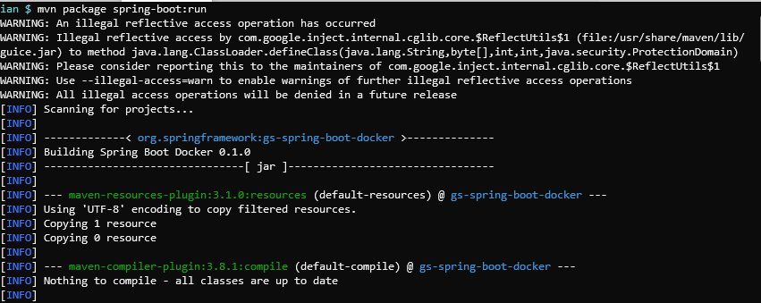
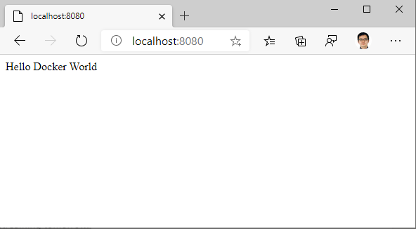
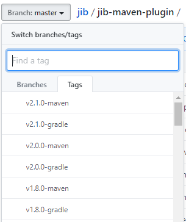
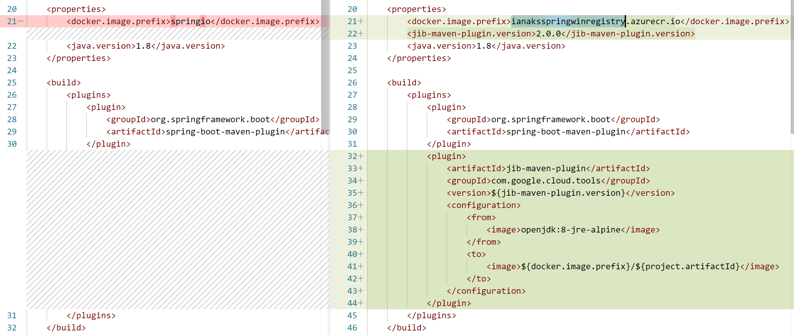
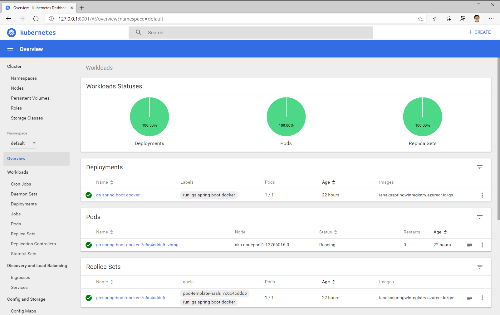

# AKS에 Spring Boot 애플리케이션 배포

[Docs에 설명된 문서](https://docs.microsoft.com/ko-kr/azure/java/spring-framework/deploy-spring-boot-java-app-on-kubernetes?wt.mc_id=AID2463800_QSG_SCL_361864&ocid=AID2463800_QSG_SCL_361864&utm_medium=Owned%20%26%20Operated&utm_campaign=FY20_APAC_Dev%20Community_CFT_Internal%20Social) 내용을 기반으로 실습을 진행합니다.

## 필요 소프트웨어

### Recommended

- [Visual Studio Code](https://code.visualstudio.com): `pom.xml` 등 편집 용이를 위해 권장하며, 없어도 실습하는데 지장은 없습니다.
- Docker: Linux, [Windows](https://docs.docker.com/docker-for-windows/) or [MacOS](https://docs.docker.com/docker-for-mac/install/) - 로컬에서 컨테이너화할 때 필요합니다.
- Java Development Kit: [OpenJDK](https://openjdk.java.net/)도 괜찮습니다. 최신 버전이어도 무방하며, [Zulu OpenJDK](https://docs.microsoft.com/java/azure/jdk/?view=azure-java-stable?wt.mc_id=AID2463800_QSG_SCL_361864&ocid=AID2463800_QSG_SCL_361864&utm_medium=Owned%20%26%20Operated&utm_campaign=FY20_APAC_Dev%20Community_CFT_Internal%20Social)도 좋은 선택지가 될 것으로 보입니다.
- [apache-maven](http://maven.apache.org/download.cgi): 실행 경로를 잘 잡아 `mvn -version`이 잘 실행되도록 준비하시면 됩니다.
- Azure CLI: Windows, Linux, and/or [MacOS](https://docs.microsoft.com/ko-kr/cli/azure/install-azure-cli-macos?view=azure-cli-latest)

### MacOS 참고
- [Homebrew](https://brew.sh/)를 사용하면 `brew install maven` 명령어를 통해 openjdk 또한 함께 설치 가능하며, `brew install azure-cli` 로 `az` (Azure CLI) 명령어 또한 쉽게 설치 가능합니다.

## 과정

1. Test [a Spring sample app](https://github.com/spring-guides/gs-spring-boot-docker) locally






2. Create ACR

 - Azure 구독 선택: 여러 구독이 있을 경우, 사용하고자 하는 구독을 선택할 필요가 있습니다.
 - 리소스 그룹 생성: Azure Pass를 이용할 경우, 한국 리전이 아닌 `southeastasia` 를 권장합니다.
 - ACR 이름: 하이픈(-)이 들어가지 않는 것이 좋은 것 같습니다. 다른 분들과 겹치지 않는 고유한 이름이어야 합니다.

```
az acr create --resource-group [your resource group] --location southeastasia \
 --name [unique name] --sku Basic
```

 - ACR 로그인시: `az acr login` 으로 연동시키는 것이 제일 쉬운데, 사실 `docker login` 등도 가능합니다. 자세한 내용은 [링크](https://docs.microsoft.com/ko-kr/azure/container-registry/container-registry-authentication?wt.mc_id=AID2463800_QSG_SCL_361864&ocid=AID2463800_QSG_SCL_361864&utm_medium=Owned%20%26%20Operated&utm_campaign=FY20_APAC_Dev%20Community_CFT_Internal%20Social)를 참고 부탁드립니다.

3. Upload Docker image to ACR

- [최신 버전의 jib-maven-plugin](https://github.com/GoogleContainerTools/jib/tree/master/jib-maven-plugin)이 [문서](https://docs.microsoft.com/ko-kr/azure/java/spring-framework/deploy-spring-boot-java-app-on-kubernetes#push-your-app-to-the-container-registry-via-jib?wt.mc_id=AID2463800_QSG_SCL_361864&ocid=AID2463800_QSG_SCL_361864&utm_medium=Owned%20%26%20Operated&utm_campaign=FY20_APAC_Dev%20Community_CFT_Internal%20Social)와 다를 수 있습니다. 버전을 확인하는 간단한 방법은 실제 저장소에서 `Tags` 를 살펴보는 것입니다.



- `pom.xml` 파일 변경 사항 diff 예시



4. Create AKS

- 리소스 그룹, AKS 클러스터 이름, DNS 이름 등에 유의하여 생성합니다. 역시 고유한 이름이어야 합니다.

```
az aks create --resource-group=[your resource group] --name=[unique AKS name] \ 
 --dns-name-prefix=[unique DNS name] --generate-ssh-keys
```

5. Deploy to AKS cluster

- `kubectl get services --watch` 식으로 `--watch` 옵션을 붙여 `EXTERNAL-IP`가 업데이트 되면 바로 확인이 가능합니다.

- 배포에 대한 scalability는 아래 명령어로 바로 확인 가능합니다.

```
kubectl scale deployment/gs-spring-boot-docker --replicas=2
```

- 웹 인터페이스가 잘 나타나지 않는 경우, 아래 명령어를 실행합니다 ([출처](https://m.blog.naver.com/hahaysh/221631554409)).

```
kubectl create clusterrolebinding kubernetes-dashboard --clusterrole=cluster-admin --serviceaccount=kube-system:kubernetes-dashboard
```




## 관련 발표 자료

- [링크](Containers%20and%20Kubernetes-share.pdf)