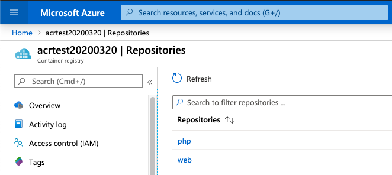
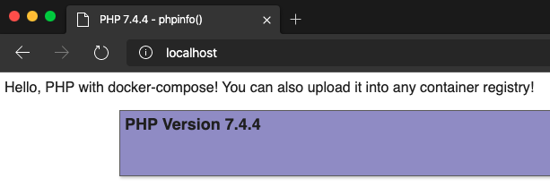

# docker-compose & ACR 사용하기 (nginx & PHP 예제)



## Explanation

- 로컬에서 아래 내용을 참고하여 build 및 up까지 테스트를 합니다.

  - 샘플 `docker-compose.yml` 은 web과 php 2개의 이미지로 구성되어 있습니다.
  - web: nginx
  - php: php-fpm (테스트 버전: 7.4)

    - volumes에 사용하는 설정 파일 및 호스팅 폴더 등을 연결시켜 줍니다.



- [이전 핸즈온랩에 설명된 ACR](../04-Java-AKS/README.md)를 참고하여 ACR을 생성합니다 (로그인까지 해둘 것)

- `docker-compose.yml` 에서 `[your acr name]` 부분을 만든 ACR 이름으로 변경합니다.

- `docker-compose push` 명령어를 사용하면 ACR에 업로드가 됩니다.

### docker-compose 관련 명령어

### 1. 이미지 빌드
(변경 사항이 생기는 경우 rebuild를 실행할 것)
```
docker-compose build
docker-compose up -d
```

빌드할 때 로컬 이미지를 오버라이딩하는 방법: 캐시를 사용하지 않음으로써 재빌드 & 오버라이딩
```
docker-compose build --no-cache
```

### 2. 컨테이너 접근

컨테이너 내부에 접근하기: 로그 파일 확인 등
```
docker exec -ti <container_id|container_name> bash
```

