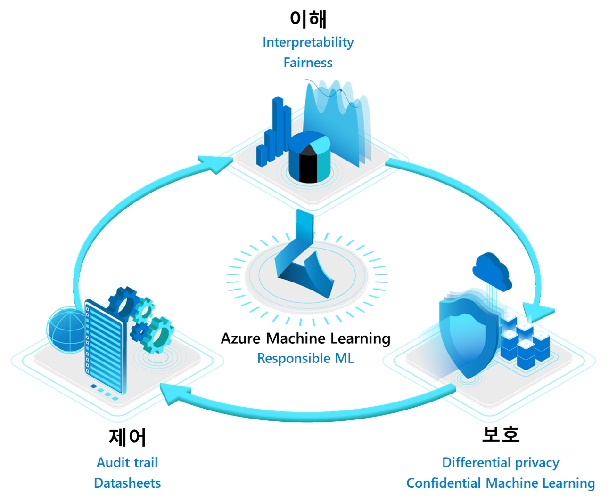
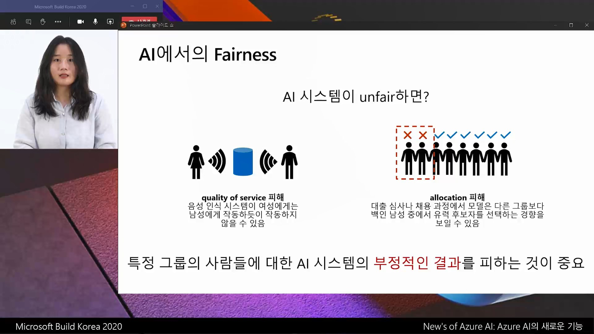
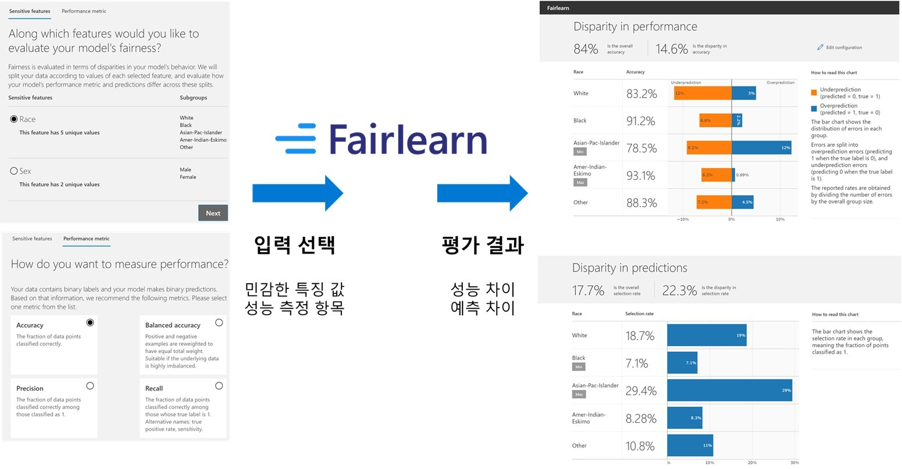
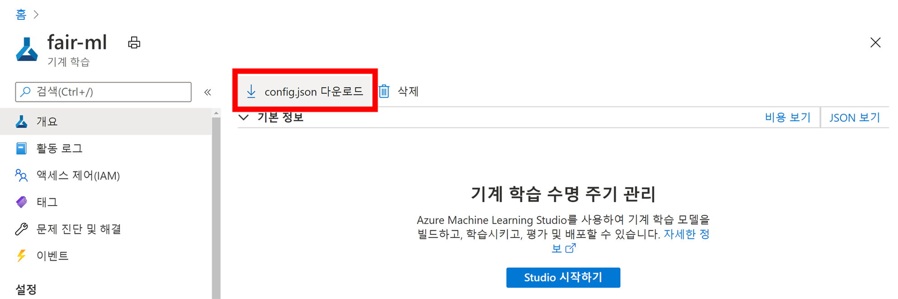
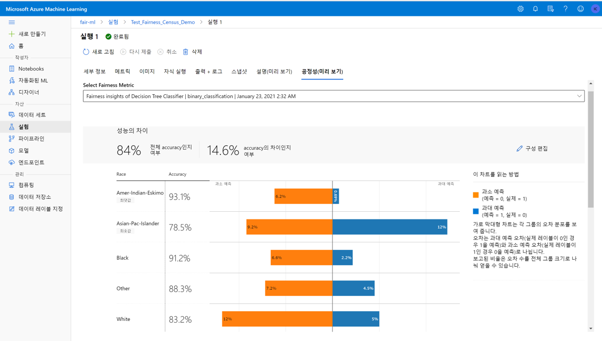

# Azure Machine Learning with Fairlearn open source

How can we guarantee that artificial intelligence (AI) has fairness? Even though someone designs a system with great machine learning algotithms and data with good purposes, AI may shows unintended & unfair results such as gender, cultural, and ethnic bias.



When I watched Build 2020 event (digital event, free!) and a local (in Korean) event which highlighted Build 2020, one of my favorite topics were Responsible AI: Research, open source projects, and Azure Machine Learning all designed to help developers and data scientists <b>understand</b>, <b>protect</b>, and <b>control</b> AI systems.



Before starting with a bunch of Python code, let's first understand more on fairness aspect. [Fairlearn][fairlearn-website] explains such fairness by dividing into two following types:

- Quality of service: For example, a voice recognition system might fail to work as well for some groups of people as it does for others.

- Allocation: For example, a system for screening loan or job applications might be better at picking good candidates among some groups of people than among others.

## Evaluating your machine learning model with Fairlearn open source ##

[Fairlearn][fairlearn-website] is an open source toolkit to assess and improve the fairness of machine learning models which is written with Python and available at [GitHub][fairlearn-github]. You can start using [pip command][fairlearn-pypi] in your local environment or even your cloud like Azure. Let's see how to assess your machine learning model. First, you need to install Fairlearn library.

```
pip install fairlearn
```

Generally, machine learning models are made by defining models, training with data, and predicting with test data sets. To evaluate machine learning models, typical metrics are like accuracy, precision, recall, AUC, MAE, and RMSE considering machine learning algorithm types like classification, regression, or clustering ([Microsoft Docs][ms-docs-ml-algorithm-evaluation-model-metrics] is a great reference). Fairlearn library has functions to assess fairness based on such metrics, and to see disparity in performance and predictions. Dashboard is a really cool to see results on Jupyter notebooks.



From now, let's see how to use Fairlearn with one [OpenML census dataset][openml-adult-census-1590]. [fetch_openml() function on Scikit-learn][scikit-learn-fetch_openml] is an easy way to retrieve such dataset by passing dataset unique number as 1590. The goal of designing a machine learnign model in this scenario is to predict whether someone exceeds annual salary more than 50K or not. Note that it is a best practice to drop sensitive features like sex and races before training the model with a dataset.

```
import numpy as np
import pandas as pd

from sklearn.datasets import fetch_openml

# 인구조사 데이터셋 불러오기
data = fetch_openml(data_id=1590, as_frame=True)

# 성별 및 인종과 같이 민감한 feature를 모델 트레이닝에서 제외
X_raw = data.data
y_true = (data.target == ">50K") * 1
A = X_raw[["race", "sex"]]
X_raw = pd.get_dummies(X_raw.drop(labels=['sex', 'race'],axis = 1))
```

Also, spliting into training set and test set is a great idea for evaluation. I allocated test set:training set ratio as 3:7 from the origital data set, and re-aligned index numbers.

```
from sklearn.model_selection import train_test_split

# 데이터를 "train" (트레이닝) 및 "test" (테스트) 셋으로 분리
(X_train, X_test, y_train, y_test, A_train, A_test) = train_test_split(
    X_raw, y_true, A, test_size=0.3, random_state=12345, stratify=y_true
)

# Ensure indices are aligned between X, y and A,
# after all the slicing and splitting of DataFrames
# and Series
X_train = X_train.reset_index(drop=True)
X_test = X_test.reset_index(drop=True)
y_train = y_train.reset_index(drop=True)
y_test = y_test.reset_index(drop=True)
A_train = A_train.reset_index(drop=True)
A_test = A_test.reset_index(drop=True)
```

Then, let's train your model with the data sets. The following code uses [DecisionTreeClassifier for classification in Scikit-learn][scikit-learn-tree] by setting sample values to *min_samples_leaf* and *max_depth* (tuning would be another topic). I can see accuracy, precision, recall, and other metrics, but it is not easy to judge whether the machine learning model is fair or not with such metrics.

```
from sklearn.tree import DecisionTreeClassifier
from sklearn.metrics import accuracy_score, precision_score, recall_score, f1_score, roc_auc_score

classifier = DecisionTreeClassifier(min_samples_leaf=10, max_depth=4)
classifier.fit(X_train, y_train)

y_pred_tr=classifier.predict(X_test)
print('Accuracy: %.3f' % accuracy_score(y_test, y_pred_tr))
print('Precision: %.3f' % precision_score(y_test, y_pred_tr))
print('Recall: %.3f' % recall_score(y_test, y_pred_tr))
print('F1 score: %.3f' % f1_score(y_test, y_pred_tr))
print('AUC: %.3f' % roc_auc_score(y_test, y_pred_tr))
```

*FairlearnDashboard()* function calls a dashboard on Jupyter notebooks. Specifying a dataset and the machine model results to show a dashboard to select sensitive features and to see disparity in performance and predictions. Also, you can see underprediction / overprediction values.

```
# View this model in Fairlearn's fairness dashboard, and see the disparities which appear:
from fairlearn.widget import FairlearnDashboard
FairlearnDashboard(sensitive_features=A_test, 
                   sensitive_feature_names=['Race', 'Sex'],
                   y_true=y_test,
                   y_pred={"model": y_pred_tr})
```

## Uploading models / experiments to Azure Machine Learning Service ##

To integrate Fairlearn with Azure Machine Learning Service, you need to have <b>Azure Machine Learning Service</b> resource on Azure. See [Microsoft Learn][ms-learn-azure-ml-workspace] for more details on Azure Machine Learning Service. From now, sample codes depend on [azureml-sdk][azureml-sdk-pypi] and related libraries. This YAML file shows the list of related libraries:

https://github.com/Azure/MachineLearningNotebooks/blob/master/contrib/fairness/upload-fairness-dashboard.yml

In Azure Machine Learning Service, `config.json` file has all configurations to connect to Azure Machine Learning Service resouce on Azure from your local or cloud environment. If you just use Jupyter notebook on Azure Machine Learning Studio, `config.json` file is already in your compute machine environment.



```
# 애저 머신 러닝 서비스 연결에 필요한 정보를 가져옴
from azureml.core import Workspace, Experiment, Model
import joblib
import os

# config.json 파일에서 설정을 가져옴
# 참고: https://docs.microsoft.com/ko-kr/azure/machine-learning/how-to-configure-environment#workspace
ws = Workspace.from_config()
ws.get_details()
```

The next step is to register your model to Azure Machine Learning Service.

```
os.makedirs('models', exist_ok=True)

# 사용한 모델 등록이 필요함 (여러 번 할 필요가 없으며, 이미 모델을 등록하였다면 기존 모델을 가져오도록 변경해야 함)

# Function to register models into Azure Machine Learning
def register_model(name, model):
    print("Registering ", name)
    model_path = "models/{0}.pkl".format(name)
    joblib.dump(value=model, filename=model_path)
    registered_model = Model.register(model_path=model_path,
                                    model_name=name,
                                    workspace=ws)
    print("Registered ", registered_model.id)
    return registered_model.id

# Call the register_model function 
dt_classifier_id = register_model("fairness_DecisionTreeClassifier", classifier)
```

To manage results calculated by Fairlearn, you need to first calculate metrics related with fairness.

```
# 공정성에 대한 메트릭을 미리 계산

#  Create a dictionary of model(s) you want to assess for fairness 
sf = { 'Race': A_test.race, 'Sex': A_test.sex}
ys_pred = { dt_classifier_id:y_pred_tr }

from fairlearn.metrics._group_metric_set import _create_group_metric_set

dash_dict = _create_group_metric_set(y_true=y_test,
                                    predictions=ys_pred,
                                    sensitive_features=sf,
                                    prediction_type='binary_classification')
```

Next, log the current status as experiement, and upload to Azure Machine Learning Service.

```
# 미리 계산된 공정성 메트릭을 애저 머신 러닝 서비스에 업로드

from azureml.contrib.fairness import upload_dashboard_dictionary, download_dashboard_by_upload_id

exp = Experiment(ws, "Test_Fairness_Census_Demo-testset")
print(exp)

run = exp.start_logging()

# Upload the dashboard to Azure Machine Learning
try:
    dashboard_title = "Fairness insights of Decision Tree Classifier"
    # Set validate_model_ids parameter of upload_dashboard_dictionary to False if you have not registered your model(s)
    upload_id = upload_dashboard_dictionary(run,
                                            dash_dict,
                                            dashboard_name=dashboard_title)
    print("\nUploaded to id: {0}\n".format(upload_id))

    # To test the dashboard, you can download it back and ensure it contains the right information
    downloaded_dict = download_dashboard_by_upload_id(run, upload_id)
finally:
    run.complete()
    
# 애저 머신 러닝 서비스 내에서 확인 가능
```

Then, you can see on Azure Machine Learning Studio - see *Fairness* tab :)



> See also Jupyter notebook at [here](fairlearn-quickstart-on-AzureMLStudio.ipynb)!

[ms-ai-approach]: https://www.microsoft.com/en-us/ai/our-approach
[fairlearn-website]: https://fairlearn.github.io
[fairlearn-github]: https://github.com/fairlearn/fairlearn
[fairlearn-pypi]: https://pypi.org/project/fairlearn/
[ms-docs-ml-algorithm-evaluation-model-metrics]: https://docs.microsoft.com/en-us/azure/machine-learning/algorithm-module-reference/evaluate-model#metrics
[openml-adult-census-1590]: https://www.openml.org/d/1590
[scikit-learn-fetch_openml]: https://scikit-learn.org/stable/modules/generated/sklearn.datasets.fetch_openml.html
[scikit-learn-tree]: https://scikit-learn.org/stable/modules/tree.html
[scikit-learn-model-evaluation]: https://scikit-learn.org/stable/modules/model_evaluation.html
[mlops-101-seokjin-youtube]: https://www.youtube.com/playlist?list=PLDZRZwFT9Wku509LgbJviEcHxX4AYj3QP
[ms-learn-azure-ml-workspace]: https://docs.microsoft.com/en-us/learn/modules/intro-to-azure-machine-learning-service/2-azure-ml-workspace
[azureml-sdk-pypi]: https://pypi.org/project/azureml-sdk/
[fairlearn-metrics-package]: https://fairlearn.github.io/v0.5.0/api_reference/fairlearn.metrics.html
[azureml-core-experiment-class]: https://docs.microsoft.com/en-us/python/api/azureml-core/azureml.core.experiment(class)?view=azure-ml-py
